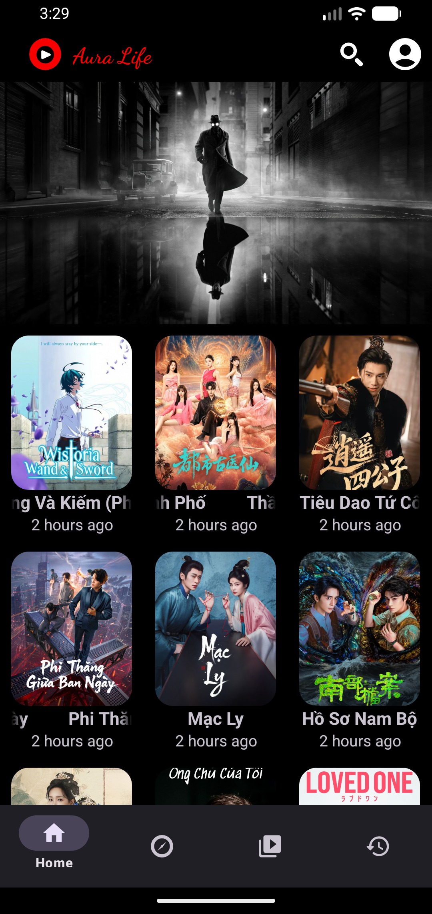
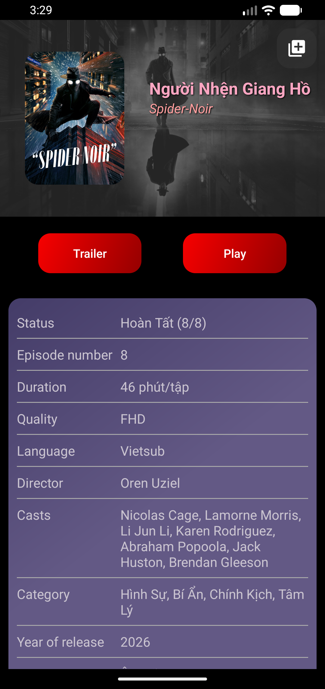
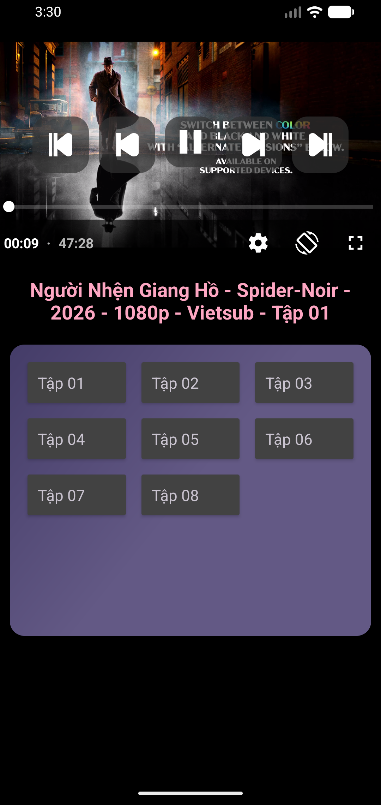

# AuraLife

[](https://kotlinlang.org)
[](https://developer.android.com)
[](LICENSE)

> Android movie streaming app with Clean Architecture, multi-module, and premium throttling.

## Screenshots

<p align="middle">
  
  
  
</p>

## Features

- Browse latest films, categories, and search with debounced input
- Film details with episode list, quality info, cast, and trailers
- Video player with HLS streaming and premium throttle
- Personal library (CRUD) with film collections
- Watch history tracking with position resume
- Premium subscription management
- Offline caching via Room + Firebase Realtime DB sync
- Pagination, error handling, loading states

## Tech Stack

| Category | Libraries |
|----------|-----------|
| Language | Kotlin 2.0 |
| Architecture | Clean Architecture + Multi-module (27 modules) |
| DI | Dagger Hilt |
| UI | ViewBinding, Jetpack Compose, Material 3 |
| Navigation | Jetpack Navigation (fragment-ktx) |
| Networking | Retrofit + OkHttp + Gson |
| Local DB | Room (with TypeConverters) |
| Backend | Firebase Auth + Realtime DB |
| Player | AndroidX Media3 ExoPlayer (HLS) |
| Images | Glide |
| Async | Kotlinx Coroutines + Flow |
| Lint | KtLint |

## Architecture

```
:app  →  :feature/*  →  :data  →  :domain  ←  :core/*
                                    ↕
                                pure Kotlin
```

Layered dependency rule: **outer layers depend on inner layers**, never the reverse.

- **`:domain`** — zero platform dependencies. Contains `model/`, `repository/` (interfaces), `usecase/`.
- **`:data`** — implements domain repository interfaces. Orchestrates remote API + local Room cache + Firebase.
- **`:core/*`** — shared infrastructure: networking, DI, navigation, design system.
- **`:feature/*`** — one module per screen. Each has its own `nav_graph.xml`.
- **`:app`** — root DI graph and `NavHost`.

## Modules

```
app/
domain/          — Business logic, pure Kotlin
data/            — Repository implementations, data sources
core/
├── common/      — Utils, validators, DispatcherProvider
├── network/     — Retrofit, OkHttp, FilmAPI, DTOs
├── firebase/    — Firebase Auth, Realtime DB
├── database/    — Room, DAOs, entities
├── navigation/  — NavRoutes, AppNavigator
└── designsystem/— Shared resources, themes, custom views
feature/
├── splash/      → onboarding/ → auth/ → home/
├── explore/     — Categories + detail grid
├── film-detail/ — Film info, episodes
├── film-player/ — ExoPlayer with premium throttle
├── library/     — Film collections CRUD
├── history/     — Watch history
├── search/      — Debounced search
└── payment/     — Premium purchase
```

## Setup

```bash
# 1. Clone
git clone https://github.com/HiepNP0901/Aura-Life.git

# 2. Add secrets.properties (gitignored)
echo "baseUrl=https://your-api.com" > secrets.properties

# 3. Build
./gradlew assembleDebug

# 4. Install on device / emulator
adb install app/build/outputs/apk/debug/app-debug.apk
```

### Release build

```bash
# Add signing config to secrets.properties
echo "keystorePath=C:\\\\.android\\\\aura-life.release.keystore" >> secrets.properties
echo "keystorePassword=..." >> secrets.properties
echo "keyAlias=aura-life" >> secrets.properties
echo "keyPassword=..." >> secrets.properties

# Build signed APK
./gradlew :app:assembleRelease
```

## License

```
MIT License

Copyright (c) 2026 HiepNP

Permission is hereby granted, free of charge, to any person obtaining a copy
of this software and associated documentation files...
```
